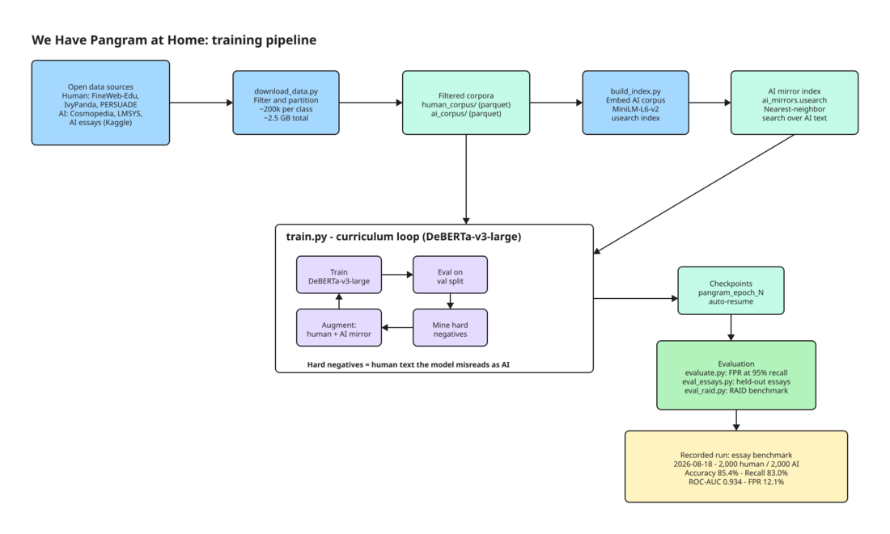

# We Have Pangram at Home

A from-scratch AI-text detector built with open models and open data. The
project follows the approach in the Pangram technical report. It is also a
record of a first attempt at training a language model, mistakes included.

The detector classifies text as human-written or AI-generated. It uses
DeBERTa-v3-large, a transformer model from Microsoft. Training uses a
curriculum loop: the model trains, finds hard examples, and adds them to the
dataset.

## Results

The table shows the essay benchmark run from 2026-08-18, the first run with
a valid evaluation set. The set holds 2,000 human and 2,000 AI samples, all
from sources the model never saw during training.

| Metric | Value |
|---|---|
| Samples | 4,000 |
| Accuracy | 85.4% |
| Precision | 87.3% |
| Recall (AI text detected) | 83.0% |
| F1 score | 0.8506 |
| ROC-AUC | 0.934 |
| False positive rate (default threshold) | 12.1% |

The model detects 83% of AI text at the default threshold. It flags 12% of
human text as AI. The ROC-AUC of 0.934 shows that the model ranks text well:
you can move the threshold to trade recall against false positives. A lower
false positive rate is possible, at the cost of catching less AI text.

Context: the first recorded run (2026-01-31) looked better — 100% precision
and 0% false positive rate. Those numbers were meaningless. The evaluation
set contained no human samples because the human sources failed to load, and
the script kept running. The class-balance guard in `scripts/eval_essays.py`
exists to prevent that. Pangram reports near-zero false positive rates at
high accuracy; closing the gap needs more data and more epochs.

## Results on RAID

The essay benchmark tests in-domain text. RAID tests text the model never
saw: 11 generator models, 11 domains, and 11 adversarial attacks. The table
shows RAID runs from 2026-08-18, 5,000 human and 5,000 AI samples each,
essay domains only.

| Metric | Clean (no attacks) | With attacks |
|---|---|---|
| Accuracy | 84.1% | 76.4% |
| Precision | 87.2% | 74.7% |
| Recall (AI text detected) | 80.0% | 80.0% |
| F1 score | 0.8345 | 0.7726 |
| ROC-AUC | 0.892 | 0.810 |

Two findings stand out. First, the clean RAID run (ROC-AUC 0.89) lands close
to the in-domain essay run (0.93). The model separates human from AI text
across generators it never trained on. Second, adversarial attacks cost
about 8 points of ROC-AUC and roughly double the false positive rate on
human text (about 12% clean, about 27% attacked, at the same 80% recall,
derived from precision and recall). Every detector without adversarial
training has this weak spot; it is the gap Pangram sells against.

## How it works



The editable source of the diagram is `pangram-pipeline.excalidraw`.

1. **Collect data.** `scripts/download_data.py` fetches open sources. Human
   text comes from FineWeb-Edu, IvyPanda, and PERSUADE (via the Kaggle AI
   Essays set). AI text comes from Cosmopedia, LMSYS, and the Kaggle AI
   Essays set. The script writes parquet files to `data/human_corpus` and
   `data/ai_corpus`.
2. **Build an index.** `scripts/build_index.py` embeds the AI corpus with
   MiniLM-L6-v2 and stores the vectors in a usearch index. The index provides
   nearest-neighbor search over AI text.
3. **Train.** `train.py` runs the curriculum loop:
   - Train DeBERTa-v3-large on the current set.
   - Evaluate on the validation split.
   - Mine hard negatives: run the model over the held-out human pool, then
     take the samples the model most likely calls AI. These are potential
     false positives.
   - Retrieve the nearest AI mirrors for those samples from the index. Add
     the pairs to the training set.
   - Repeat. Checkpoints resume automatically.
4. **Evaluate.** Three scripts cover three benchmarks: `evaluate.py` (FPR at
   95% recall), `scripts/eval_essays.py` (held-out essay sets), and
   `scripts/eval_raid.py` (the RAID benchmark).

## Quick start

Requirements: Python 3.10+, a Mac with Apple Silicon (MPS), or an NVIDIA GPU
(CUDA).

```bash
git clone https://github.com/anaqvi02/we-have-pangram-at-home.git
cd we-have-pangram-at-home
pip install -r requirements.txt
```

Set these environment variables first. Kaggle downloads need
`KAGGLE_USERNAME` and `KAGGLE_KEY`. Gated Hugging Face sets need `HF_TOKEN`.

```bash
python scripts/download_data.py --target 200000
python scripts/verify_quick.py
python scripts/build_index.py
python train.py --epochs 3
python evaluate.py --model_path checkpoints/pangram_final
python scripts/eval_essays.py --model_path checkpoints/pangram_final
python scripts/eval_raid.py --model_path checkpoints/pangram_final
```

The download is about 2.5 GB. Training uses MPS on Apple Silicon by default;
`FORCE_CPU=1` forces CPU. `src/config.py` holds the rest of the knobs
(context length 512, learning rate 1e-5, batch size by VRAM class).

## Reference project

**Pangram, Technical Report on the Pangram AI-generated Text Classifier**
(https://www.pangram.com/research/papers).

The project borrows the transformer detector design, the hard-negative mining
loop, and the FPR-at-high-recall metric. It differs in model and data:
DeBERTa-v3-large is open, the corpora are open, and the scale is smaller. The
whole run fits on one laptop or one Modal job.

Datasets and benchmarks used, all open: FineWeb-Edu, IvyPanda essays,
Cosmopedia, LMSYS-Chat-1M (Hugging Face), and the AI-vs-Human-Text set incl.
PERSUADE 2.0 (Kaggle). Evaluation uses HC3, GPT-wiki-intro, and RAID by
Dugan et al.

## Repository layout

```
scripts/     data download, index build, evaluation
src/         config, model, data loading, mining, trainer
notebooks/   cloud training notebook (Modal)
tests/       benchmark fixtures
train.py     training entry point
evaluate.py  evaluation entry point
```

## Lessons learned

- **Check the class balance of an eval set.** A single-class eval set
  produces meaningless FPR and precision. The eval script swallowed the
  human-source load failure and printed confident numbers. Fail loudly
  instead.
- **Memory-mapped parquet keeps RAM flat.** Large corpora stream from disk;
  tokenization happens per batch.
- **Hard-negative mining is easy to add.** A small embedding model plus a
  vector index is enough to implement the Pangram loop.
- **Scale matters.** A 50k-per-class start set and 3 epochs did not approach
  Pangram-level accuracy. More data and more epochs are the obvious next
  step.

## Limitations

- At the default threshold, the model misses 20% of AI text and flags about
  12% of human text as AI; adversarial attacks raise that to about 27%.
- Training text comes from encyclopedic and academic sources. Informal text
  (chat, social media) will score differently.
- Adversarial robustness is not measured. The RAID harness exists; recorded
  results do not.

## Author

[anaqvi02](https://github.com/anaqvi02)
