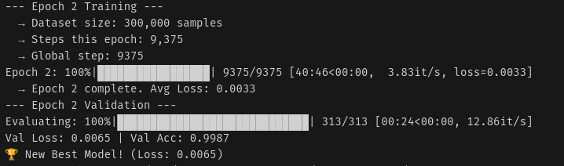
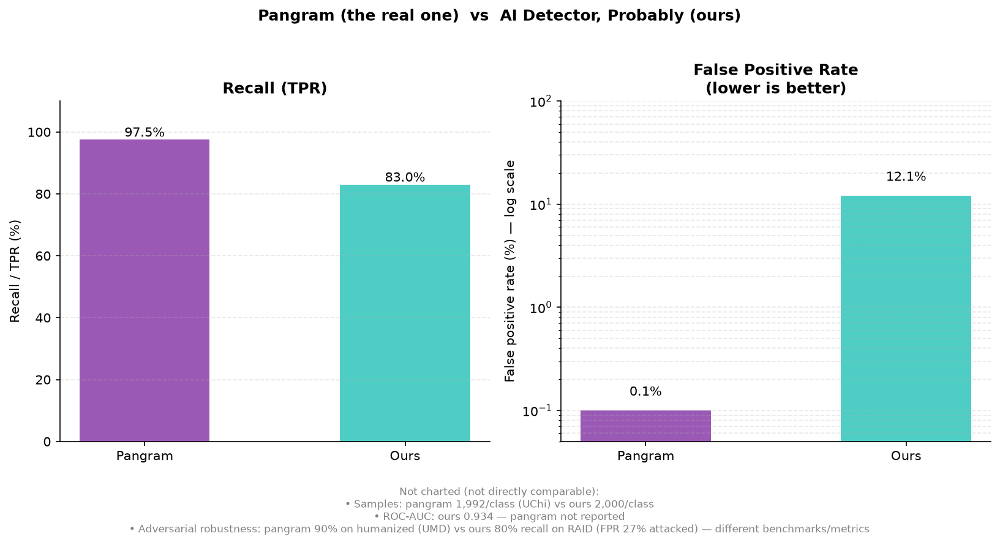
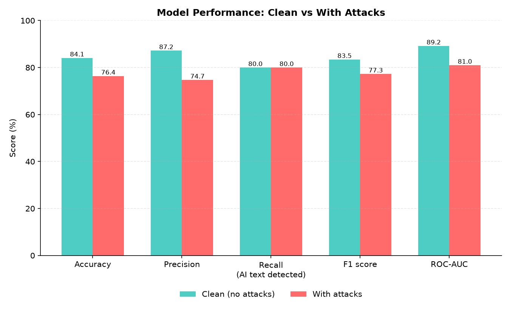
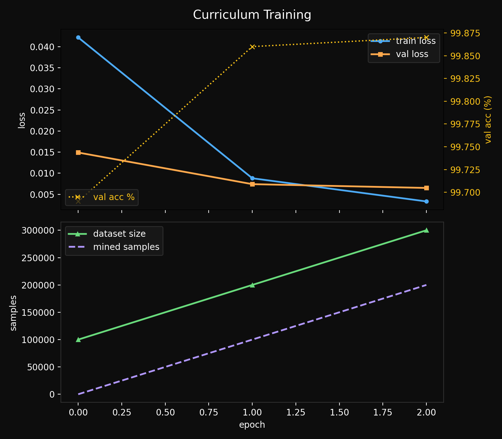

<div align="center">


---

[](https://www.python.org/)
[](https://pytorch.org/)
[](https://huggingface.co/microsoft/deberta-v3-large)
[](#results)
[](https://modal.com/)

<p align="center">
  A custom-built AI detector using publicly available human and AI essay data,<br>
  basing our approach on the <a href="https://arxiv.org/abs/2402.14873">Pangram technical report</a>.
</p>

</div>

This is also our first attempt at LM training, so mistakes are included
but so are many lessons learned.

Following Pangram's approach, we implemented techniques such as mining hard
negatives, but with our own twist to save cost and time. Our best model used
3 epochs, with a total training time of around 90 minutes.



Training ran on Modal cloud with an H100*.

## Results

The table shows the essay benchmark run from our latest training run (more
details about dataset and models used below). The set holds 2,000 human and
2,000 AI samples, all from sources the model never saw during training.


The model does not come close to the established detectors, mainly due to
the messiness of the public data and our limited time. The detector could in
theory have been much more accurate if the data were better filtered, as it
still has a strong tendency to detect formality in some cases. This could be
attributed to human datasets that contain less sophisticated writing (e.g.
PERSUADE contains only 6th-12th grade writing).

However, the good thing is the ROC-AUC of 0.934 shows that the model ranks
text well, meaning you can move the threshold to trade recall against false
positives. A lower false positive rate is possible, at the cost of catching
less AI text, and vice versa if you desire higher detections.

Pangram reports near-zero false positive rates at high accuracy; closing the
gap needs more higher-quality data and more epochs.



- Pangram technical report (the paper this project replicates): https://arxiv.org/abs/2402.14873
- UChicago BFI study (FPR 0.1% / FNR 1%): https://bfi.uchicago.edu/wp-content/uploads/2025/09/BFI_WP_2025-116.pdf
- UChicago explainer: https://bfi.uchicago.edu/insights/artificial-writing-and-automated-detection/
- UMD human-detector study (90% on humanized text): https://arxiv.org/abs/2501.15654
- VUB peer-reviewed study (97.5% detection / 0% FPR, as reported by Pangram): https://link.springer.com/article/10.1007/s40979-026-00226-w
- Pangram's third-party evals roundup: https://www.pangram.com/blog/third-party-pangram-evals

## Results on RAID

The essay benchmark tests in-domain text. RAID tests text the model never
saw: 11 generator models, 11 domains, and 11 adversarial attacks. The table
shows RAID runs for 5,000 human and 5,000 AI samples each, essay domains
only.



Two findings stand out. First, the clean RAID run (ROC-AUC 0.89) lands close
to the in-domain essay run (0.93). The model separates human from AI text
quite steadily across generators it never trained on.

Second, adversarial attacks cost about 8 points of ROC-AUC and roughly
double the false positive rate on human text (about 12% clean, about 27%
attacked, at the same 80% recall, derived from precision and recall). This
is quite expected: detectors without adversarial training struggle, and ours
is no exception.

## How it works


The editable source of the diagram is `pangram-pipeline.excalidraw`.

1. **Get data.** `scripts/download_data_v5.py` fetches open sources and filters
   through them for higher-quality data.

   The human datasets: FineWeb-Edu, IvyPanda, and PERSUADE (via the Kaggle
   AI Essays set).
   The AI datasets: Cosmopedia, LMSYS, and the Kaggle AI Essays set.

   As it fetches data from these sources it performs the following:
   2. Rejects all code patterns, as well as template docs (such as legal
      documents and reports). This is achieved through structural
      anti-patterns (detecting import statements and such).
   3. Filters for ideal text sizes: 200–5,000 words, ≥2 paragraphs, ≥5
      sentences, avg sentence length 8–50 words. This avoids extremely basic
      and simple human writing, which would cause the model to sway even
      more toward detecting formality and complexity, and not whether the
      text is AI-generated.
   4. Blocks casual AI chat via sentence variation (essays have varied
      lengths, chat doesn't).
   5. Applies strict mode for chat-sourced data, since we do use sources
      from the LMSYS dataset: ≥3 paragraphs, variation ≥3, formality score
      ≥2, because raw chatbot logs are not essays. Also enables optional
      formality indicators ("this essay", "thesis", "perspective"...).

Full requirements:

| source | label | filter params | formality |
|---|---|---|---|
| fineweb_edu | human | 300–4000 words, ≥3 paragraphs | no |
| cosmopedia_stanford | AI | 300–4000 words, ≥3 paragraphs | no |
| cosmopedia_web_samples_v2 | AI | 250–4000 words, ≥2 paragraphs ("slightly more lenient") | no |
| lmsys | AI | 250–3000 words, ≥3 paragraphs | yes |
| ivypanda | human | — | not filtered at all |
| kaggle AI essays (+PERSUADE) | both | — | not filtered at all |

A lot of work went into ensuring we can collect the required amount of data at the expected quality efficiently. Because sources like LMSYS require much stricter filtering, extracting good essay data from them is considerably harder. To solve this, a 4-Phase Dynamic Balancing Pipeline dynamically adjusts source quotas based on extraction difficulty. By sampling 5,000 examples per source to measure empirical acceptance yields, the pipeline calculates optimal quota allocations and download targets to maintain a diverse, balanced dataset.


Final values, the set was very close to being balanced. 

After that the script writes parquet files to `data/human_corpus` and
`data/ai_corpus`.

2. **Build an index.** `scripts/build_index.py` embeds the AI corpus with
   MiniLM-L6-v2 and stores the vectors in a usearch index. The index
   provides nearest-neighbor search over AI text. This allows us to skip
   generating live AI mirrors of human text for the hard negative mining;
   instead, we can just search for a text that is already available and
   semantically similar. This cuts down on cost and speeds up training.

3. **Train.** `train.py` runs the curriculum loop:
   1. Train DeBERTa-v3-large on the current set.
   2. Evaluate on the validation split.
   3. Mine hard negatives: run the model over the held-out human pool, then
      take the samples the model most likely calls AI. These are potential
      false positives.
   4. Retrieve the nearest AI mirrors for those samples from the index. Add
      the pairs to the training set.
   5. Repeat. Checkpoints resume automatically.

4. **Evaluate.** Three scripts cover three benchmarks: `evaluate.py` (FPR at
   95% recall), `scripts/eval_essays.py` (held-out essay sets), and
   `scripts/eval_raid.py` (the RAID benchmark).

Training results: after 3 epochs of training, the model reached a
considerably good in-domain validation of 99.875% and starts to plateau in
its improvements. Train loss also looks healthy as the model fits the
dataset better during each epoch.

We can also see the hard negative cycle at work as the dataset continues to
grow, as the model discovers ~100k hard-negative pairs that are added to the
training set per round.



## Quick start

Requirements: Python 3.10+, a Mac with Apple Silicon (MPS), or an NVIDIA GPU
(CUDA).

```bash
git clone https://github.com/anaqvi02/we-have-pangram-at-home.git
cd we-have-pangram-at-home
pip install -r requirements.txt
```

Set these environment variables first. Kaggle downloads need
`KAGGLE_USERNAME` and `KAGGLE_KEY`. Gated Hugging Face sets need `HF_TOKEN`.

```bash
python scripts/download_data.py --target 200000
python scripts/verify_quick.py
python scripts/build_index.py
python train.py --epochs 3
python evaluate.py --model_path checkpoints/pangram_final
python scripts/eval_essays.py --model_path checkpoints/pangram_final
python scripts/eval_raid.py --model_path checkpoints/pangram_final
```

The download is about 2.5 GB. Training uses MPS on Apple Silicon by default;
`FORCE_CPU=1` forces CPU. `src/config.py` holds the rest of the knobs
(context length 512, learning rate 1e-5, batch size by VRAM class).

## Reference project

**Pangram, Technical Report on the Pangram AI-generated Text Classifier**
(https://www.pangram.com/research/papers).

The project borrows the transformer detector design, the hard-negative
mining loop, and the FPR-at-high-recall metric. It differs in model and
data: DeBERTa-v3-large is open, the corpora are open, and the scale is
smaller.

Datasets and benchmarks used, all open: FineWeb-Edu, IvyPanda essays,
Cosmopedia, LMSYS-Chat-1M (Hugging Face), and the AI-vs-Human-Text set incl.
PERSUADE 2.0 (Kaggle). Evaluation uses HC3, GPT-wiki-intro, and RAID by
Dugan et al.

## Repository layout

```
scripts/     data download, index build, evaluation
src/         config, model, data loading, mining, trainer
notebooks/   cloud training notebook (Modal)
tests/       benchmark fixtures
train.py     training entry point
evaluate.py  evaluation entry point
```

## Lessons learned

- **Check the class balance of an eval set.** A single-class eval set
  produces meaningless FPR and precision. The eval script swallowed the
  human-source load failure and printed confident numbers. Fail loudly
  instead.
- **Memory-mapped parquet keeps RAM flat.** Large corpora stream from disk;
  tokenization happens per batch.
- **Hard-negative mining is easy to add.** A small embedding model plus a
  vector index is enough to implement the Pangram loop.
- **Scale matters.** A 50k-per-class start set and 3 epochs did not approach
  Pangram-level accuracy. More data and more epochs are the obvious next
  step.

## Limitations

- At the default threshold, the model misses 20% of AI text and flags about
  12% of human text as AI; adversarial attacks raise that to about 27%.
- Training text comes from encyclopedic and academic sources. Informal text
  (chat, social media) will score differently.
- Adversarial robustness is not measured. The RAID harness exists; recorded
  results do not.

## Authors

[Peter Shao](https://github.com/Peteryhs) and [Ali Naqvi](https://github.com/anaqvi02)
